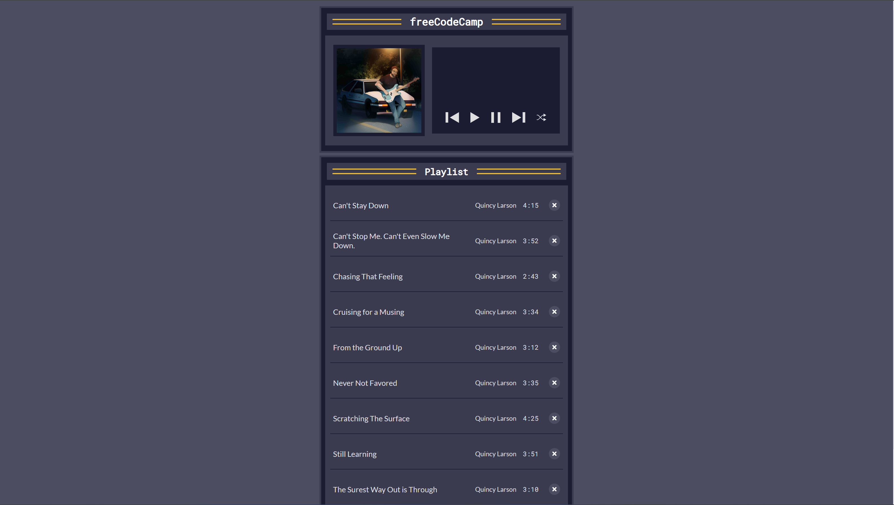

# Music Player App

## Challenge Description

This code sets up a Music Player app that allows users to play, pause, skip, and shuffle through a playlist. It features album art, song titles, and artist names, and tracks the currently playing song. The app includes controls for navigating through the playlist and an interface to view and manage the playlist.

## Preview

## Live Demo

Check out the live demo on my [Code Pen](https://codepen.io/Yashi-Singh/pen/VwJpWyp).

## Prerequisites

- Basic HTML/CSS/JavaScript Knowledge.

## Tools Used

1. **VS Code** (You can use any other code editor)
2. **A modern web browser** (Chrome, Firefox, Safari, or Edge)
3. **Access to an internet connection** for resource imports

## Contributing

If you'd like to contribute to this challenge:

1. **Fork** the repository on GitHub.
2. **Clone** your forked repository to your local machine:
   <pre>
   git clone https://github.com/Yashi-Singh-1/Music-Player-App.git
    </pre>
3. **Create a new branch** for your feature or bug fix:
   <pre>
   git checkout -b feature-name
   </pre>
4. **Make your changes** and commit them with a clear and concise message:
   <pre>
   git commit -m 'Add new feature or fix'
   </pre>
5. **Push** your changes to your forked repository:
   <pre>
   git push origin feature-name
   </pre>
6. **Open a pull request** to the main repository.
7. Ensure your pull request includes a detailed description of your changes.
8. Respond to any feedback or questions during the review process.

We welcome improvements, bug fixes, and additional features that can enhance this Music Player app.